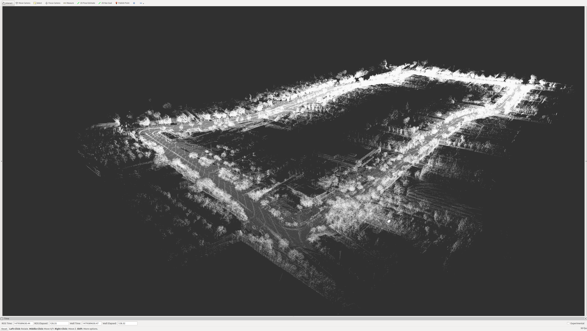

# Velodyne-in-ROS
Install Velodyne in ROS environment

https://github.com/ros-drivers/velodyne

## Install Velodyne Driver
```
$ sudo apt-get update
$ sudo apt-get upgrade

$ mkdir -p ~/catkin_ws/src
$ cd ~/catkin_ws/src
$ git clone https://github.com/ros-drivers/velodyne.git
```
Install dependences into rosdistro kinetic

```
$ cd ..
$ rosdep install --from-paths src --ignore-src --rosdistro kinetic -y
```

Make and source
```
$ catkin_make
$ source devel/setup.bash
```

## Test the Velodyne pointcloud
I am using the Udacity Challenge 3 dataset. 
https://medium.com/udacity/challenge-3-image-based-localization-5d9cadcff9e7.

<p align="center">
 
</p>

```
$ roscore
```
Goto /Downloads
```
$ rosbag play cal_loop.bag
```

In new terminal,
```
$ rostopic list
/velodyne_packets
```

```
$ rostopic echo /velodyne_packets
```
Here is the results

header: 
  seq: 6501
  stamp: 
    secs: 1461760558
    nsecs: 532258800
  frame_id: "map"
height: 1
width: 641
fields: 
  - 
    name: "x"
    offset: 0
    datatype: 7
    count: 1
  - 
    name: "y"
    offset: 4
    datatype: 7
    count: 1
  - 
    name: "z"
    offset: 8
    datatype: 7
    count: 1
is_bigendian: False
point_step: 16
row_step: 10256
data: [124, 94, 132, 194, 74, 130, 28, 66, 32, 73, 192, 190, 0, 0, 128, 63, 216, 91, 132, 194, 136, 65, 28, 66, 226, 54, 189, 190, 0, 0, 128, 63, 73, 77, 132, 194, 27, 29, 28, 66, 40, 87, 185, 190, 0, 0, 128, 63, 131, 66, 132, 194, 70, 239, 27, 66, 120, 180, 181, 190, 0, 0, 128, 63, 251, 35, 132, 194, 3, 242, 27, 66, 196, 205, 176, 190, 0, 0, 128, 63, 9, 25, 132, 194, 110, 196, 27, 66, 180, 38, 173, 190, 0, 0, 128, 63, 72,
, 194, 30, 247, 27, 66, 196, 144, 207, 190, 0, 0, 128, 63]
is_dense: True
---


